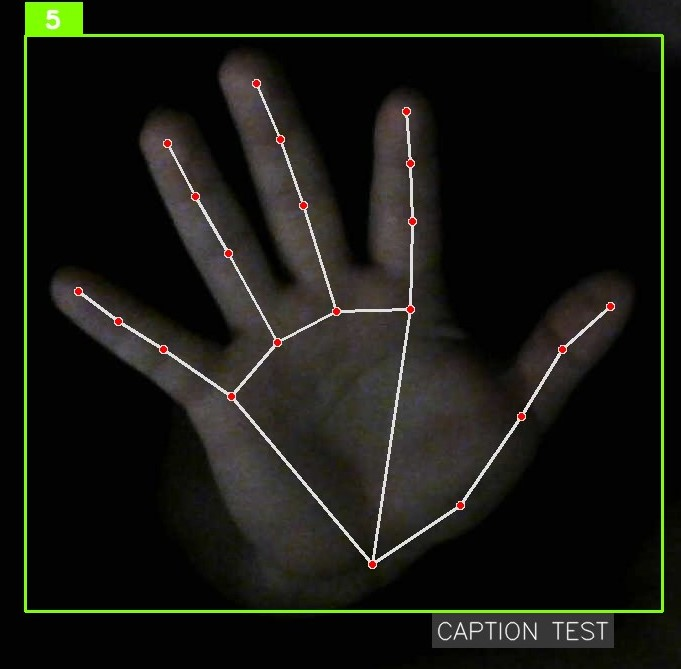
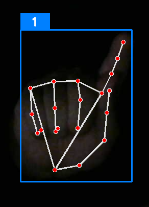
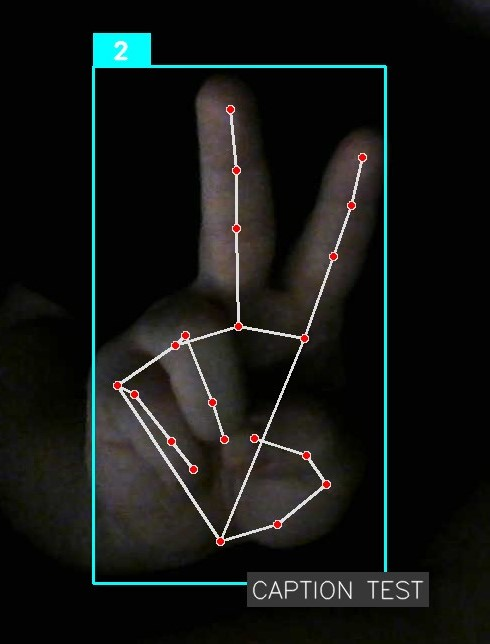
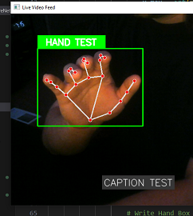

<!-- Author Images Row -->
<p align="center">
  
  
  
  
</p>

# ✋ ASL-GestureNet


##  Project Overview 

**ASL-GestureNet** is a real-time American Sign Language recognition system that reads **21-point hand keypoints** from a webcam and classifies them into ASL letters.  It runs live on video, predicts gestures frame-by-frame, and shows the recognized character as an on-screen caption.

###### **Authors**
- [GravityGravity](https://github.com/GravityGravity)
- [Howzley](https://github.com/Howzley)
- [mcalvelo28](https://github.com/mcalvelo28)

---

## ▶️ How to Run ASL-GestureNet

Run the system by executing:

```bash
python hand.py
```

Wait for startup to finish, then press **ENTER**. When prompted, type **1** to load the CNN or **2** to load the MLP, and press **ENTER** again. After the model loads, the webcam window will appear and hand tracking will begin automatically. The MLP is recommended, as it achieved ~95% accuracy without overfitting.

You can control the system using the hotkeys below:

**General Hotkeys**
- **Q** — Quit program (auto-saves CSV if recording is active)  
- **X** — Clear on-screen caption  
- **V** — Toggle caption mode ON/OFF  
- **A** — Toggle AUTO / MANUAL caption type  

**Caption Mode**
- **SPACE** — In MANUAL mode, append current letter (or space)  
- **ENTER** — Save caption to file and clear it  

**Recording Mode**
- **R** — Start recording (prompt for CSV name)  
- **C** — Stop recording and save CSV  
- **SPACE** — Save current frame’s keypoints (when recording)  
- **F** — Change active label/class for recording  

Running `hand.py`, selecting a model, and using these hotkeys provides the full real-time ASL recognition workflow.


## Model Development & Results

As a team of three, we created our own ASL keypoint dataset by capturing thousands of labeled hand poses using our custom recording tool. We experimented with two model architectures: a 1D **Convolutional Neural Network (CNN)** and a simpler **Multilayer Perceptron (MLP)**.

The CNN quickly learned the training set but showed clear signs of **overfitting**, struggling to generalize to new samples. In contrast, the MLP handled our keypoint-based inputs far better. With proper normalization and training, it achieved **~95% test accuracy** without overfitting.

One remaining challenge is the gestures for **“0” and “O”**, which are visually identical in static ASL. Because both signs share the same hand shape, the model (and even humans) cannot reliably distinguish them from keypoints alone. This ambiguity is expected and noted in our results.


## Project Goals

- **Build a custom ASL dataset** using webcam-captured hand keypoints.
- **Train a lightweight classifier** that predicts static ASL letters from 21-point landmarks.
- **Run real-time gesture recognition** with smooth, low-latency performance.
- **Display live captions** and automatically log recognized sequences.
- **Provide modular tools** for data collection, training, and inference.
- 
<p align="center">
  
</p>
